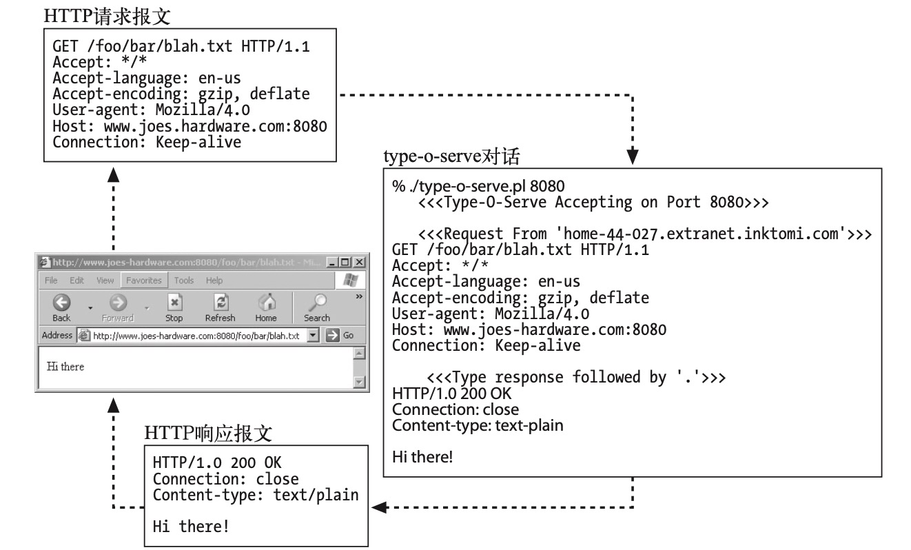

---

layout: doc
editLink: false
aside: false
lastUpdated: true
date: 2025-12-19 08:09

---

# 最小的Perl Web服务器

要构建一个特性完备的 HTTP 服务器，是需要做一些工作的。Apache Web 服务器的内核有超过 50 000 行的代码，那些可选处理模块的代码量更是远远超过这个数字。<br><br>
这个软件所要做的就是支持 HTTP/1.1 的各种特性：<sapn class="marker-text-highlight">丰富的资源支持、虚拟主机、访问控制、日志记录、配置、监视和性能特性</sapn>。在这里，可以用少于 30 行的 Perl 代码来创建一个最小的可用 HTTP 服务器。我们来看看这是怎么实现的。<br><br>
例 5-1 显示了一个名为 type-o-serve 的小型 Perl 程序。这个程序是个很有用的诊断工具，可以用来测试与客户端和代理的交互情况。与所有 Web 服务器一样，type-o-serve 会等待 HTTP 连接。只要 type-o-serve 收到了请求报文，就会将报文打印在屏幕上，然后等待用户输入（或粘贴）一条响应报文，并将其回送给客户端。通过这种方式，<sapn class="marker-evy">type-o-serve 假扮成一台 Web 服务器，记录下确切的 HTTP 请求报文</sapn>，并允许用户回送任意的 HTTP 响应报文。

```perl
#!/usr/bin/perl

use Socket;
use Carp;
use FileHandle;

# (1) use port 8080 by default, unless overridden on command line
$port = (@ARGV ? $ARGV[0] : 8080);

# (2) create local TCP socket and set it to listen for connections
$proto = getprotobyname('tcp');
socket(S, PF_INET, SOCK_STREAM, $proto) || die;
setsockopt(S, SOL_SOCKET, SO_REUSEADDR, pack("l", 1)) || die;
bind(S, sockaddr_in($port, INADDR_ANY)) || die;
listen(S, SOMAXCONN) || die;

# (3) print a startup message
printf("    <<<Type-O-Serve Accepting on Port %d>>>\n\n",$port);

while (1)
{
    # (4) wait for a connection C
    $cport_caddr = accept(C, S);
    ($cport,$caddr) = sockaddr_in($cport_caddr);
    C->autoflush(1);

    # (5) print who the connection is from
    $cname = gethostbyaddr($caddr,AF_INET);
    printf("    <<<Request From '%s'>>>\n",$cname);

    # (6) read request msg until blank line, and print on screen
    while ($line = <C>)
    {
  print $line;
  if ($line =~ /^\r/) { last; }
    }

    # (7) prompt for response message, and input response lines,
    #     sending response lines to client, until solitary "."
    printf("    <<<Type Response Followed by '.'>>>\n");

    while ($line = <STDIN>)
    {
  $line =~ s/\r//;
  $line =~ s/\n//;
  if ($line =~ /^\./) { last; }
  print C $line . "\r\n";
    }

    close(C);
}

```

<br>
- 首先，管理员启动了 type-o-serve 诊断服务器，在一个特定的端口上监听。由于Joe 的五金商店已经有一个产品化的 Web 服务器在监听 80 端口了，所以管理员用下面这条命令在端口8080 （可以选择任意未用端口） 上启动了type-o-serve 服务：<br>

::: code-group
```shell [sh]
type-o-serve.pl 8080
```
:::

- 只要type-o-serve 开始运行了， 就可以将浏览器指向这个Web 服务器。 在图5-2 中，浏览器指向了 http://www.joes-hardware.com:8080/foo/bar/blah.txt。
- type-o-serve 程序收到来自浏览器的 HTTP 请求报文，并将 HTTP 请求报文的内容打印在屏幕上。然后 type-o-serve 诊断工具会等待用户输入一条简单的响应报文，后面跟着只有一个句号的空行。
- type-o-serve 将 HTTP 响应报文回送给浏览器，浏览器会显示响应报文的主体。


图 5-2 type-o-serve <sapn class="marker-text">实用程序让用户输入服务器响应，将其回送给客户端</sapn>

内容摘自《HTTP权威指南》
