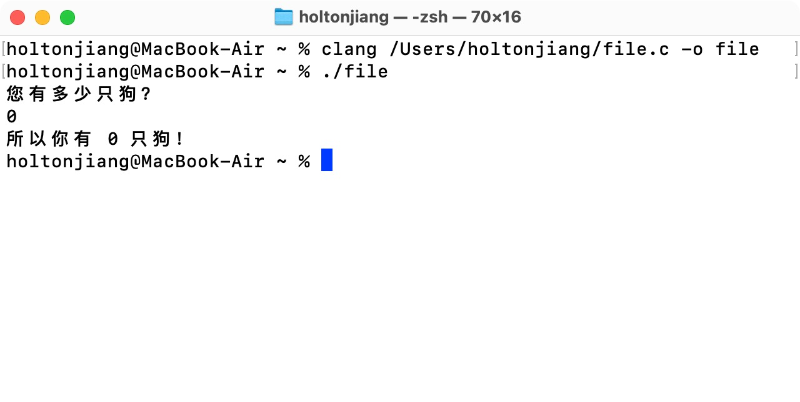

---

layout: doc
editLink: false
aside: false
lastUpdated: true
date: 2025-12-19 08:09

---

# 代码示例
### 1-1

[[toc]]

```c
#include <stdio.h>
int main(void)
{
    int dogs;
    printf("您有多少只狗？\n");
    scanf("%d", &dogs);
    printf("所以你有 %d 只狗！\n", dogs);
    return 0;
}
```

::: code-group

```shell [clang]
clang file.c -o file
```

```md:img [Terminal 控制台]

```
:::